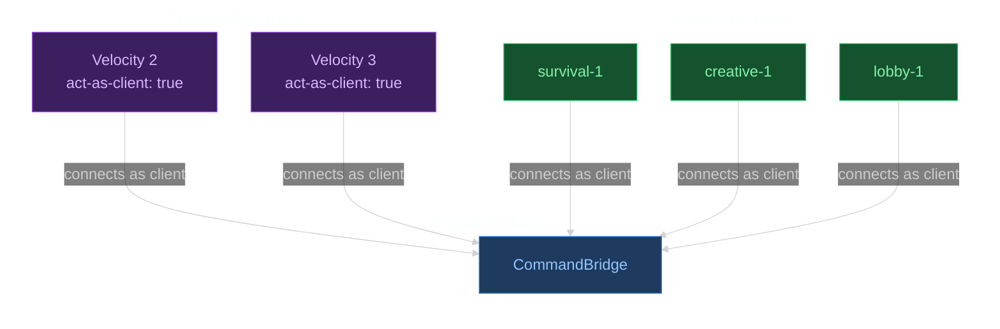
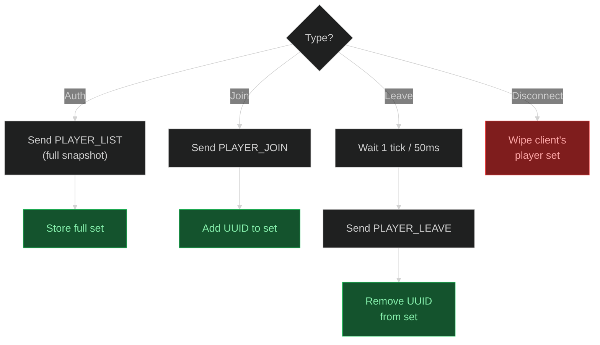

CB supports setups with more than one Velocity proxy. I already talked about this in the [Configuration](/docs/configuration/) overview, but here is the full picture.

The idea is simple: only one Velocity runs in server mode. Every other Velocity instance runs as a client. That is what the `act-as-client` value in the config is for.
The client-mode proxies connect to the main one and behave like any other backend: they authenticate, receive command registrations, and execute commands. The only difference is that CB internally marks them as `VELOCITY` instead of `BACKEND`, so it knows they are proxies and not actual game servers.



So there is no mesh or anything fancy. One proxy manages everything, the rest just connect to it.


Only **one** Velocity instance can run in server mode. If you start two proxies in server mode on the same Redis instance or the same WebSocket port, things will break.


---

## act-as-client

On every Velocity that should not be the main one, open `plugins/commandbridge/config.yml` and set:

```yaml
act-as-client: true
```

That is the only thing you change in `config.yml`. When this is enabled, CB ignores everything else in that file; endpoints, security, timeouts, all of it. Instead it reads the connection config from a separate file called `client.yml`.

---

## client.yml

When `act-as-client` is `true`, CB creates a `client.yml` in `plugins/commandbridge/` on first startup. This file looks exactly like a backend config, because that is basically what this proxy becomes:

```yaml
client-id: proxy-2
endpoint-type: WEBSOCKET
endpoints:
  websocket:
    host: 127.0.0.1
    port: 8765
  redis:
    host: 127.0.0.1
    port: 6379
    username: ''
    password: ''
security:
  tls-mode: TOFU
  tls-pin: ''
  secret: change-me
timeouts:
  auth-timeout: 5
  reconnect-timeout: 60
  reconnect-interval: 5
debug: false
```

If you already configured a backend before, this should look familiar. It is the same schema as the [Backends](/docs/configuration/backends/) config.
The `client-id` is the unique name for this proxy, `endpoints` point to wherever the primary proxy is reachable, and `security` needs the same secret as everything else.
I will not explain every field again here since it is identical to the backend config.


The `config.yml` is still read on startup to check the `act-as-client` flag. But when it is `true`, everything else in `config.yml` is skipped and `client.yml` takes over completely.


---

## Registering & executing across proxies

In your scripts, you can target more than one instance for both registration and execution. So if you have three Velocity proxies, you can register a command on all of them:

```yaml
register:
  - id: "proxy-1"
    location: VELOCITY
  - id: "proxy-2"
    location: VELOCITY
  - id: "proxy-3"
    location: VELOCITY
```

You can mix proxies and backends too:

```yaml
register:
  - id: "proxy-1"
    location: VELOCITY
  - id: "survival-1"
    location: BACKEND
```

The `location` tells CB what type of target it is: `VELOCITY` for a proxy (primary or client-mode), `BACKEND` for a game server.

The `execute` section works the same way. You can send a command to client-mode proxies, backends, or both:

---

## Player presence tracking

CB tracks which players are on which server in real time. Every client, both backends and client-mode proxies, reports player changes to the primary. The primary stores all of this in a tracker that maps each client ID to a set of player UUIDs.

The initial sync on auth is a full snapshot so both sides start from the same state. After that, joins and leaves are sent individually. 



> The delay on leave is there so the player is actually gone from the server's player list before the message is sent.

---

## target-required

The `target-required` setting controls whether a command should only execute on a target if the player is actually on that server. This is where the player tracking from above comes in.

```yaml
server:
  target-required: true
```

When this is enabled, CB checks the player tracker before dispatching to each target. If the player is not on that target, the command is skipped for it.

This works for both **BACKEND** and **VELOCITY** targets. Since every client, whether it is a Paper backend or a client-mode Velocity, sends its player data to the primary, CB has full visibility across the entire network. 
It does not matter which proxy the player originally connected through. If a backend reports that `uuid-123` is online, the primary knows about it.

For the primary Velocity itself there is a small shortcut: CB does not need to check the tracker because the primary already knows its own players directly. But for every remote target the tracker is used, regardless of whether it is a backend or another proxy.
So if you have `target-required: true` and the player is on `survival-1`, the command runs on `survival-1` and gets skipped on `creative-1`.
