CommandBridge secures the communication between your proxy and backends with two independent layers: a **shared secret** for authentication and **TLS** for encryption. Both work in WebSocket and Redis mode.

---

## Shared secret

On the first startup, Velocity generates a file called `secret.key` inside `plugins/commandbridge/`. The content is a random 32-byte key encoded in Base64 (43 characters). It looks something like this:

```key
9RDP43dYvjk8tos86QkU9QxG1V20O27LTR8AN0bPfeg
```

This key is used for mutual HMAC-SHA256 authentication. That means both sides prove to each other that they know the secret, without ever sending it over the wire:

```mermaid
%%{init: {'theme': 'dark', 'themeVariables': {'fontSize': '18px', 'clusterBkg': 'transparent', 'clusterBorder': 'transparent', 'edgeLabelBackground': 'transparent'}, 'flowchart': {'padding': 20, 'nodeSpacing': 30, 'rankSpacing': 60}} }%%
flowchart LR
    subgraph b1 [" Backend "]
        direction TB
        B1["Generate random clientNonce"] --> B2["Compute HMAC(clientId : clientNonce)"]
    end

    B2 -- "AUTH_REQUEST<br/>{ clientId, clientNonce, hmac }" --> V1

    subgraph v [" Velocity "]
        direction TB
        V1["Recompute HMAC<br/>(clientId : clientNonce)"] --> V2{"HMAC<br/>match?"}
        V2 -- "No" --> V3["Close connection"]
        V2 -- "Yes" --> V4["Generate random serverNonce"] --> V5["Compute HMAC<br/>(clientId : clientNonce : serverNonce)"]
    end

    V3 -- "AUTH_FAIL" --> FAIL["Connection rejected"]:::reject

    V5 -- "AUTH_OK<br/>{ serverNonce, serverHmac }" --> B3

    subgraph b2 [" Backend "]
        direction TB
        B3["Recompute HMAC<br/>(clientId : clientNonce : serverNonce)"] --> B4{"Server proof<br/>valid?"}
    end

    B4 -- "No" --> FAIL2["Untrusted server"]:::reject
    B4 -- "Yes" --> OK["Mutual authentication<br/>complete"]:::success

    classDef reject fill:#5c1a1a,stroke:#ef4444,color:#fca5a5
    classDef success fill:#14532d,stroke:#22c55e,color:#86efac
```



The backend signs its client ID and a random nonce with HMAC-SHA256, Velocity verifies it and responds with its own proof using a second nonce, and then the backend verifies that proof. If either side fails, the connection is immediately rejected.


Keep `secret.key` private. Anyone with this key can authenticate to your proxy and execute commands across your network.


## Setting up the secret

On backends, copy the key from Velocity's `secret.key` file into your backend config:

```yaml
security:
  secret: "9RDP43dYvjk8tos86QkU9QxG1V20O27LTR8AN0bPfeg"
```

If you leave the `secret` field blank in the backend config, CommandBridge will fall back to loading from the backend's own `secret.key` file. So alternatively you can just copy the `secret.key` file itself to every backend.


The default value for `secret` is `change-me`. If you forget to change it, the plugin will warn you in the console. Change it before going to production.


On Velocity, you do not need to configure anything. The proxy always loads the secret from the `secret.key` file directly. If the file does not exist, it generates a new one.


On Linux, `secret.key` is created with `600` permissions (owner read/write only). On Windows this is not possible, so make sure the file is not publicly accessible.


---

## TLS

TLS encrypts all traffic between the proxy and backends so nobody can read or tamper with it. CommandBridge supports three TLS modes.

> Make sure that the mode is always the same on all servers, otherwise the connection will fail!


TLS only applies to **WebSocket mode**. In Redis mode, CommandBridge does not manage TLS. If you want encrypted Redis connections, configure that in your Redis server directly.


---

### PLAIN

No encryption. All traffic is sent in plain text over the wire.

```yaml
security:
  tls-mode: PLAIN
```

In this mode, the WebSocket URL uses `ws://` instead of `wss://`.


`PLAIN` disables all transport encryption. Anyone who can intercept traffic between your servers can read commands and secrets. Do not use this in production!


---

### TOFU (Trust On First Use)

This is the **default mode** and the one you should use in most cases. It gives you encrypted connections without any manual certificate management.

```yaml
# Velocity
security:
  tls-mode: TOFU

# Backend
security:
  tls-mode: TOFU
  tls-pin: ""
```

Here is how it works:

1. On first startup, Velocity generates a self-signed TLS certificate and stores it in `keystore.p12` alongside a randomly generated password in `keystore.pass`
2. The certificate uses RSA 2048-bit with SHA256withRSA and is valid for 10 years
3. When a backend connects for the first time and `tls-pin` is empty, it automatically trusts and pins the server's certificate for that session
4. If you want persistent pinning, copy the SPKI pin from the Velocity startup log into the backend config

The SPKI pin is logged by Velocity on startup and looks like this:

```
TLS SPKI pin: sha256/aBcDeFgHiJkLmNoPqRsTuVwXyZ0123456789ABCDEFG=
```

To use persistent pinning, put that value in the backend config:

```yaml
security:
  tls-pin: "sha256/aBcDeFgHiJkLmNoPqRsTuVwXyZ0123456789ABCDEFG="
```

If you leave `tls-pin` empty, the backend will pin the certificate in memory on every fresh connection. This is still secure for the duration of that session, but it means a man-in-the-middle could theoretically intercept the very first connection. 
For most Minecraft servers this is not a realistic threat, but if you want the extra safety, set the pin manually.

> TOFU gives you encryption with zero manual certificate management. Unless you have a specific reason to change it, keep this as the default.

---

### STRICT

In this mode you provide your own keystore with your own certificate. CommandBridge does not generate anything.

```yaml
# Velocity
security:
  tls-mode: STRICT
  keystore-path: "/path/to/your/keystore.p12"
  keystore-password: "your-password"
  keystore-type: PKCS12
```

Supported keystore formats are `PKCS12` and `JKS`. If `keystore-type` is not set, it defaults to `PKCS12`.

On the backend side, you need to set the SPKI pin of the certificate in the keystore:

```yaml
# Backend
security:
  tls-mode: STRICT
  tls-pin: "sha256/your-pin-here"
```

Use `STRICT` when you have a certificate issued by a CA, when your organization requires specific certificates, or when the TOFU trust model is not acceptable for your setup.


In `STRICT` mode, `keystore-path`, `keystore-password`, and `keystore-type` are all required on Velocity. If any of them are missing, the plugin will not start.


---

## Which mode should you use?

| Scenario | Recommended mode |
|---|---|
| Local development / same machine | `TOFU` |
| Production / servers on different machines | `TOFU` |
| Corporate / compliance requirements | `STRICT` |
| You just don't care about encryption (or testing something) | `PLAIN` |

