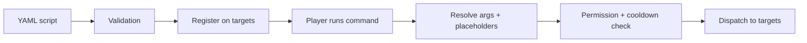

### Overview

CommandBridge scripts are YAML files that define custom commands and what happens when they're run. Scripts live in the `plugins/commandbridge/scripts/` folder on your server.

| Context | What it does |
|---------|-------------|
| **Scripts on Velocity** | Register commands on the proxy or backends, execute commands anywhere in the network. |
| **Scripts on backends** | Register commands on the backend, forward execution to the proxy or other backends. |


Scripts define custom commands your players or console can run across your network.


### How scripts work

1. You write a YAML file defining a command, its arguments, and what commands to run
2. On startup (or `/cb reload`), CommandBridge validates the script and registers the command on the targets listed in `register`
3. When a player or console runs the command, the dispatch pipeline resolves arguments and placeholders, checks permissions and cooldowns, then forwards the command to each target in `execute`



### Script location

Place `.yml` files in:

```
plugins/commandbridge/scripts/
```

Files are loaded on startup. Use `/cb reload` to reload without restarting.

### Next steps

- [Syntax](/docs/scripting/syntax/) -- full YAML reference for all script fields
- [Argument Types](/docs/scripting/argument-types/) -- all 21 supported types
- [Placeholders](/docs/scripting/placeholders/) -- built-in `${arg}` placeholders
- [PlaceholderAPI](/docs/scripting/placeholderapi/) -- PAPI integration
- Examples: [Alert](/docs/scripting/example-alert/), [Lobby](/docs/scripting/example-lobby/), [Economy](/docs/scripting/example-economy/), [Punishment](/docs/scripting/example-punishment/)
