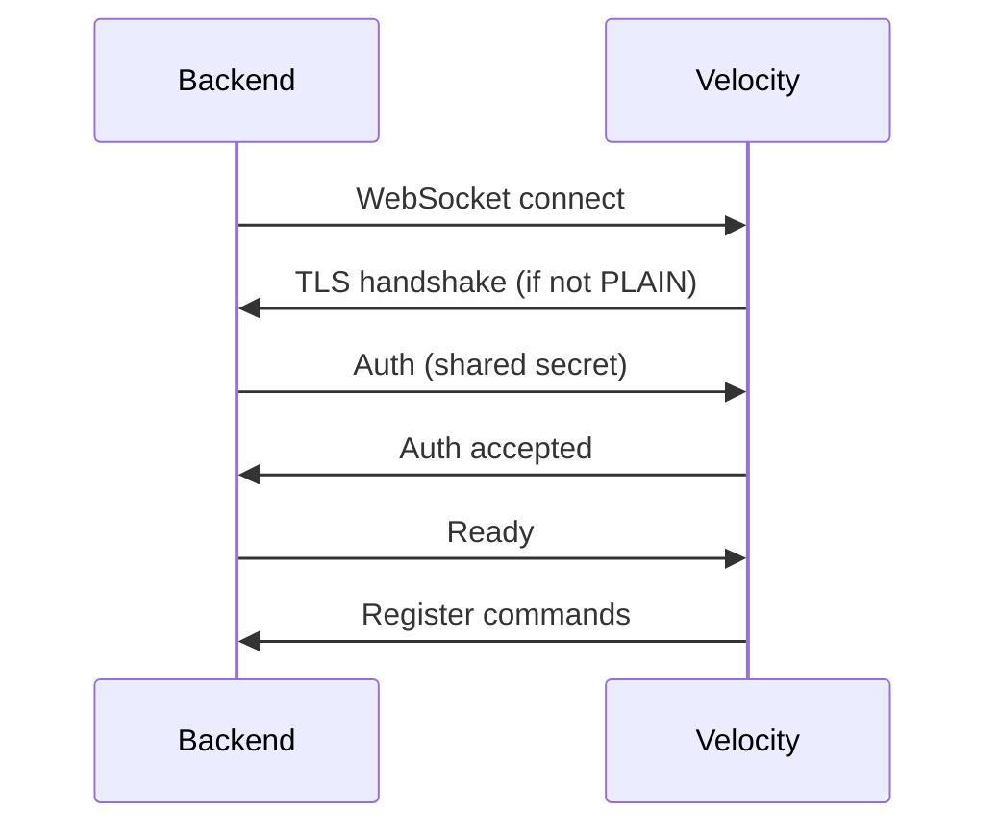

CommandBridge uses two layers of security: a **shared secret** for authentication and **TLS** for encryption.

---

## Shared secret

On first startup, Velocity generates a `secret.key` file containing a random key. Each backend must include this key in its config to authenticate:

```yaml
# Backend config.yml
security:
  secret: "paste-your-secret-here"
```

Authentication happens during the WebSocket handshake. If the secret doesn't match, the connection is rejected.


Never share your `secret.key` publicly. Anyone with the key can connect to your proxy and execute commands.


You can disable authentication by setting `require-auth: false` on both sides, but this is **not recommended** outside of local testing.

---

## TLS

TLS encrypts all traffic between the proxy and backends. CommandBridge supports three TLS modes.

### PLAIN

No encryption. All traffic is sent in plain text.

```yaml
security:
  tls-mode: PLAIN
```

Only use this for local development where proxy and backends are on the same machine.

### TOFU (Trust On First Use)

**Default mode.** The proxy generates a self-signed certificate on first startup. When a backend connects for the first time, it automatically trusts and pins the proxy's certificate.

```yaml
# Velocity
security:
  tls-mode: TOFU

# Backend
security:
  tls-mode: TOFU
  tls-pin: ""  # Auto-populated on first connection
```

After the first successful connection, the backend saves the certificate fingerprint in `tls-pin`. Future connections verify the proxy's certificate against this pin.


TOFU is the recommended mode for most setups. It provides encryption with zero manual certificate management.


#### Re-pinning

If you regenerate the proxy's TLS certificate (e.g. by deleting the `tls/` folder), you need to clear the `tls-pin` on each backend and let them re-pin:

1. Delete the `tls/` folder on Velocity and restart to generate a new cert
2. Set `tls-pin: ""` on each backend
3. Restart backends -- they'll pin the new certificate automatically

### STRICT

Pre-shared keystore. You provide your own PKCS12 or JKS keystore.

```yaml
# Velocity
security:
  tls-mode: STRICT
  keystore-path: "/path/to/keystore.p12"
  keystore-password: "your-password"
  keystore-type: PKCS12
```

Use `STRICT` when you need a specific certificate (e.g. issued by a CA) or when TOFU's trust model isn't acceptable.

---

## Which mode to use

| Scenario | Recommended mode |
|----------|-----------------|
| Local dev / same machine | `PLAIN` or `TOFU` |
| Production / different machines | `TOFU` |
| Corporate / compliance requirements | `STRICT` |
| Don't care about encryption | `PLAIN` |

---

## Connection flow



---

## Common issues

| Problem | Fix |
|---------|-----|
| `SSL handshake failed` | TLS mode mismatch between proxy and backend. Make sure both use the same mode. |
| `Certificate pin mismatch` | Proxy cert was regenerated. Clear `tls-pin` on the backend and restart. |
| `Auth timeout` | Secret mismatch, or `require-auth` is enabled on one side but not the other. |
| Backend can't connect at all | Check firewall, port, and `host` settings. See [Troubleshooting](/docs/troubleshooting/). |
